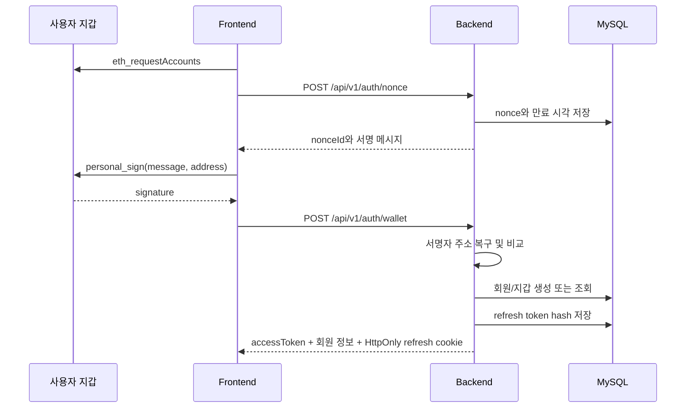

# CrypTalk 프로젝트 인수인계 문서

이 문서는 기존 채팅 기록이 없는 다른 Codex 인스턴스나 개발자가 CrypTalk 개발을 바로 이어가기 위한 기준 문서다. 구현 사실과 아직 구현하지 않은 항목을 구분해서 기록한다.

## 1. 저장소와 현재 기준점

- GitHub: `https://github.com/ghwns9652/cryptalk`
- 공개 범위: Private repository
- 기본 브랜치: `main`
- 백엔드·프론트 연동 구현 기준 커밋: `d7c3183`
- 프로젝트 루트: `/Users/khj0416/Projects/cryptalk` (기존 로컬 환경 기준)
- Git 작업 원칙: 구현 작업은 반드시 별도 Git worktree와 작업 브랜치에서 수행한다. 기본 checkout을 직접 수정하지 않는다. 완료 후 main 반영·푸시하고 worktree를 제거한다.

새 세션에서는 먼저 다음을 실행해 실제 최신 상태를 확인한다.

```bash
git status --short
git branch --show-current
git log -5 --oneline
git pull --ff-only
```

## 2. 제품 개요

CrypTalk는 암호화폐 종류별 커뮤니티다.

핵심 제품 정책은 다음과 같다.

1. 사용자는 이메일과 비밀번호로 가입·로그인하며, 기존 EVM 지갑 로그인도 지원한다.
2. 가입 계정은 지갑 메시지 서명으로 지갑을 선택적으로 연결하고 자산을 인증한다.
3. BTC, ETH, SOL, XRP, DOGE처럼 코인별로 독립된 커뮤니티 피드가 있다.
4. 사용자가 글을 작성하면 프로필 옆에 자산 공개 정보가 표시된다.
5. 해당 커뮤니티의 코인을 실제 보유한 것으로 검증된 작성자는 인증 마크를 받는다.
6. 자산 표시는 `정확한 금액`, `금액 구간`, `비공개` 중 사용자가 선택한다.
7. 게시글에는 조회할 때의 실시간 잔액이 아니라 작성 시점 자산 스냅샷을 보존한다.

현재 MVP는 이메일 회원가입·로그인, EVM 지갑 로그인·계정 연결, ETH 온체인 잔액 검증까지 구현했다. BTC, SOL, XRP, DOGE 커뮤니티와 글 작성은 가능하지만 해당 체인의 보유 인증기는 아직 없다.

## 3. 확정 기술 스택

### Backend

- Java 24
- Spring Boot 3.5.16
- Gradle 8.14.3 Wrapper
- Gradle Groovy DSL (`build.gradle`)
- Spring MVC
- Spring Data JPA / Hibernate
- Spring Security OAuth2 Resource Server
- JWT access token: Spring Security Nimbus encoder/decoder
- Liquibase formatted SQL
- MySQL 8.4 LTS
- web3j 4.12.3: Ethereum 서명 복구 및 주소 검증
- springdoc OpenAPI 2.8.17
- JUnit 5, Spring Boot Test, Spring Security Test
- 테스트 DB: H2 MySQL compatibility mode
- Testcontainers 의존성은 포함되어 있으나 MySQL 컨테이너 테스트는 아직 작성하지 않았다.

### Frontend

- TypeScript 5.9
- React 19.2
- Next 16.2 API 형태의 App Router
- Vinext 0.0.50 / Vite 8
- Cloudflare Workers 대상 빌드 구성
- Node.js 22.13 이상
- 별도 프론트 DB 또는 ORM 없음

### Infrastructure

- 프론트엔드, 백엔드, MySQL, Nginx gateway를 위한 루트 `docker-compose.yml`
- 백엔드 멀티 스테이지 `Dockerfile`
- 프론트엔드 Node.js 22 멀티 스테이지 `Dockerfile`
- Nginx가 `/`는 프론트엔드, `/api`, Swagger는 백엔드로 reverse proxy한다.
- `deploy.sh`가 private GitHub 저장소를 clone 또는 fast-forward pull한 뒤 이미지를 빌드하고 컨테이너를 교체한다.
- 프론트에는 기존 Sites/Cloudflare 설정인 `.openai/hosting.json`이 존재한다.
- 실제 호스팅 사업자와 HTTPS 종료 지점은 아직 정하지 않았다.

## 4. 기술 결정 배경

- Gradle Kotlin DSL은 Kotlin 애플리케이션 전용이 아니지만, 팀 가독성과 합의에 따라 Groovy DSL을 선택했다.
- Spring Boot 4.1.0은 구현 시점에 성숙한 안정 버전으로 보기 어려워 3.5.16을 선택했다.
- Java 24는 Gradle Java toolchain으로 지정했다. 로컬 기본 Java가 낮아도 Foojay resolver가 JDK 24를 받을 수 있다.
- Flyway 대신 Liquibase를 사용한다. 변경 이력은 YAML master 파일에서 formatted SQL을 include한다.
- Hibernate는 스키마 생성 도구로 사용하지 않는다. `ddl-auto=validate`로 Liquibase 결과와 엔티티 매핑만 검증한다.
- 지갑 주소만 제출하는 로그인은 허용하지 않는다. 서버 nonce가 포함된 메시지에 `personal_sign`하고 서버가 서명자 주소를 복구한다.
- refresh token 원문은 DB에 저장하지 않고 SHA-256 hash만 저장한다.
- 게시글 자산 표시는 후속 잔액 변동으로 바뀌지 않도록 게시 시점 KRW 자산 값을 저장한다.

## 5. 디렉터리 구조

```text
cryptalk/
├── backend/
│   ├── build.gradle
│   ├── settings.gradle
│   ├── gradlew
│   ├── Dockerfile
│   └── src/
│       ├── main/java/com/cryptalk/
│       │   ├── asset/
│       │   ├── auth/
│       │   ├── coin/
│       │   ├── comment/
│       │   ├── common/
│       │   ├── config/
│       │   ├── member/
│       │   ├── post/
│       │   └── wallet/
│       ├── main/resources/
│       │   ├── application.yml
│       │   └── db/changelog/
│       └── test/
├── frontend/
│   ├── app/page.tsx
│   ├── app/globals.css
│   ├── lib/api.ts
│   ├── worker/index.ts
│   └── tests/rendered-html.test.mjs
├── docs/
│   └── PROJECT_HANDOFF.md
├── docker-compose.yml
└── README.md
```

백엔드는 package-by-domain 구조다. 현재 규모가 작아 DTO 중 일부는 `*Dtos` 내부 record 또는 controller/service 내부 record로 두었다.

## 6. 백엔드 도메인과 책임

### `auth`

- 이메일 회원가입·로그인과 BCrypt 비밀번호 검증
- 로그인 nonce 생성 및 5분 만료
- Ethereum `personal_sign` 검증
- 최초 로그인 시 회원과 EVM 지갑 자동 생성
- 15분 access JWT 발급
- 14일 refresh token 발급 및 회전
- refresh token hash 저장과 로그아웃 revoke
- refresh token은 `cryptalk_refresh` HttpOnly cookie로 전달

### `member`

- 닉네임, 아바타 색상 관리
- 자산 공개 범위 관리
- 공개 범위 enum: `EXACT`, `RANGE`, `HIDDEN`

### `wallet`

- 회원과 체인별 주소 연결
- 로그인 회원에게 발급한 전용 nonce로 지갑 소유권을 확인해 계정에 연결
- 현재 실제 로그인 체인은 `EVM`만 지원
- EVM 주소는 소문자로 정규화해 저장

### `coin`

- 활성 코인 목록과 커뮤니티 메타데이터 제공
- 초기 코인: BTC, ETH, SOL, XRP, DOGE

### `asset`

- Ethereum JSON-RPC의 `eth_getBalance` 호출
- Wei를 ETH 수량으로 변환
- 설정된 고정 `ETH_KRW_PRICE`를 곱해 KRW 가치 계산
- 회원·코인별 최신 스냅샷 upsert
- RPC 미설정: `UNAVAILABLE`
- RPC 오류: `RPC_ERROR`
- 정상 조회: `VERIFIED`
- 인증 마크는 조회가 성공했고 수량이 0보다 큰 경우에만 true

### `post`

- 코인별 최신 게시글 목록
- 로그인 회원의 게시글 생성·삭제
- 좋아요 추가·취소
- 글 작성 시점의 해당 코인 자산 KRW 가치와 인증 여부 저장
- 응답 시 작성자의 현재 공개 설정을 적용

`RANGE` 표시 정책:

- 1천만원 미만
- 1천만~1억원
- 1억~10억원
- 10억원 이상

### `comment`

- 댓글 목록, 작성, 작성자 삭제
- 댓글 UI는 아직 프론트에 연결하지 않았다.

## 7. 인증 흐름



- JWT subject는 member ID 문자열이다.
- access token은 프론트 메모리와 `sessionStorage`에 보관한다.
- access token이 만료되어 API가 401을 반환하면 프론트가 `/auth/refresh`를 한 번 호출하고 원 요청을 재시도한다.
- refresh 시 기존 refresh token은 revoke되고 새 token으로 회전한다.
- 로컬 cookie는 `SameSite=Lax`, 운영에서 `AUTH_COOKIE_SECURE=true`이면 `SameSite=None; Secure`다.
- 운영 CORS origin은 정확한 프론트 주소만 허용해야 한다.

## 8. 자산 인증 흐름

1. 로그인 후 프론트가 `GET /api/v1/me/assets`를 호출한다.
2. 백엔드는 회원의 EVM 주소를 찾는다.
3. ETH coin 정보를 조회한다.
4. 설정된 Ethereum RPC에 `eth_getBalance(address, latest)`를 호출한다.
5. 수량, KRW 가치, 상태, 인증 여부를 `asset_snapshots`에 저장한다.
6. 글 작성 시 해당 커뮤니티 coin의 최신 snapshot을 읽는다.
7. snapshot이 verified이면 글에 `author_verified=true`와 당시 KRW 가치를 저장한다.

중요 제약:

- 현재 자동 조회되는 자산은 ETH뿐이다.
- `ETH_KRW_PRICE`는 외부 가격 API가 아니라 환경 변수의 고정값이다.
- 자산 갱신은 현재 `/me/assets` 호출 시 발생한다.
- 글 작성 직전에 서버가 자산을 강제 재조회하지 않고 마지막 snapshot을 사용한다.
- 향후에는 체인별 balance provider와 가격 provider를 인터페이스로 분리하고 snapshot freshness 정책을 정해야 한다.

## 9. API 명세

기본 URL: `http://localhost:8080/api/v1`

Swagger UI: `http://localhost:8080/swagger-ui.html`

### 공개 API

| Method | Path | 설명 |
|---|---|---|
| POST | `/auth/signup` | 이메일, 비밀번호, 닉네임으로 가입 |
| POST | `/auth/login` | 이메일과 비밀번호로 로그인 |
| POST | `/auth/nonce` | 지갑 로그인용 nonce와 메시지 발급 |
| POST | `/auth/wallet` | EVM 서명 검증 후 로그인 |
| POST | `/auth/refresh` | refresh cookie 회전 및 access token 재발급 |
| POST | `/auth/logout` | refresh token revoke 및 cookie 삭제 |
| GET | `/coins` | 활성 코인 목록 |
| GET | `/communities/{symbol}` | 커뮤니티 정보 |
| GET | `/communities/{symbol}/posts?size=30` | 커뮤니티 게시글 |
| GET | `/posts/{postId}/comments` | 댓글 목록 |

게시글 API는 익명 요청도 가능하지만 유효한 JWT가 있으면 `liked`가 개인화된다.

### 인증 필요 API

| Method | Path | 설명 |
|---|---|---|
| GET | `/me` | 내 프로필 |
| PATCH | `/me` | 닉네임 또는 아바타 색상 변경 |
| POST | `/me/wallet/nonce` | 계정 연결용 지갑 서명 메시지 발급 |
| POST | `/me/wallet` | 서명을 검증해 EVM 지갑 연결 |
| GET | `/me/assets` | 온체인 자산 갱신 및 목록 반환 |
| PATCH | `/me/asset-visibility` | `EXACT`, `RANGE`, `HIDDEN` 설정 |
| POST | `/posts` | 게시글 생성 |
| DELETE | `/posts/{postId}` | 본인 게시글 삭제 |
| POST | `/posts/{postId}/likes` | 좋아요 |
| DELETE | `/posts/{postId}/likes` | 좋아요 취소 |
| POST | `/posts/{postId}/comments` | 댓글 작성 |
| DELETE | `/comments/{commentId}` | 본인 댓글 삭제 |

### 주요 요청 예시

Nonce:

```json
{
  "walletAddress": "0x1111111111111111111111111111111111111111"
}
```

Wallet login:

```json
{
  "walletAddress": "0x1111111111111111111111111111111111111111",
  "nonceId": "UUID_FROM_NONCE_API",
  "signature": "0x..."
}
```

Create post:

```json
{
  "coinSymbol": "ETH",
  "title": "게시글 제목",
  "content": "게시글 본문"
}
```

Change visibility:

```json
{
  "visibility": "RANGE"
}
```

## 10. DB 스키마

Liquibase 기준 파일:

- `backend/src/main/resources/db/changelog/db.changelog-master.yaml`
- `backend/src/main/resources/db/changelog/001-initial-schema.sql`

테이블:

| 테이블 | 역할 | 주요 제약 |
|---|---|---|
| `members` | 이메일 계정, 비밀번호 해시, 프로필과 자산 공개 설정 | email/nickname unique |
| `wallets` | 회원별 체인 지갑 | chain_type + address unique |
| `auth_nonces` | 로그인·지갑 연결용 일회성 메시지 | UUID PK, purpose, member_id, expiry/used_at |
| `refresh_tokens` | refresh token hash | token_hash unique |
| `coins` | 코인/커뮤니티 기준 정보 | symbol unique |
| `asset_snapshots` | 회원·코인별 최신 자산 | member_id + coin_id unique |
| `posts` | 게시글 및 작성 시 자산 | coin + created_at index |
| `post_likes` | 게시글 좋아요 | post_id + member_id PK |
| `comments` | 댓글 | post + created_at index |

새 DB 변경은 기존 changeset을 수정하지 말고 새 numbered changelog를 추가한 후 master에 include한다. 아직 운영 배포 전인 초기 스키마라는 전제로 첫 구현에서만 `001`을 직접 작성했다.

## 11. 프론트엔드 연동 상태

API client는 `frontend/lib/api.ts`에 있다.

현재 연동됨:

- 코인 목록 조회
- 이메일 회원가입·로그인
- 코인 변경 시 게시글 조회
- 브라우저 injected EVM wallet 연결
- nonce 발급, `personal_sign`, 지갑 로그인 또는 기존 계정 연결
- refresh session
- 로그아웃
- ETH 자산 조회
- 게시글 작성
- 좋아요/취소
- 인증 작성자 마크와 자산 표시

현재 UI에 남은 정적/미구현 요소:

- 가격, 등락률, 멤버 수, 인증률은 프론트 `coinMeta`의 정적 값
- trending topic 정적 값
- 인기/최신 탭은 UI 상태만 바뀌고 서버 정렬은 항상 최신순
- 보유 인증 탭은 받아온 게시글을 클라이언트에서 필터링
- 전체 검색, 북마크, 내 활동, 알림은 동작하지 않음
- 댓글 API는 있으나 댓글 화면 없음
- 프로필·자산 공개 설정 변경 UI 없음
- 이미지 첨부, 태그 선택, 공유 기능 없음
- WalletConnect SDK는 없음. MetaMask/Coinbase 등 `window.ethereum`을 주입하는 EVM 지갑만 사용
- DB가 비어 있으면 피드는 빈 상태로 표시되며 데모 게시글 seed는 없음

프론트에서 제거한 항목:

- Drizzle ORM
- 프론트 D1 schema와 D1 example API
- 프론트가 소유하던 임시 데이터 저장 책임

## 12. 환경 변수

### Backend

| 변수 | 기본값 | 운영 필수 | 설명 |
|---|---|---:|---|
| `PORT` | `8080` | 선택 | 서버 포트 |
| `DB_URL` | localhost MySQL URL | 예 | JDBC URL |
| `DB_USERNAME` | `cryptalk` | 예 | DB 사용자 |
| `DB_PASSWORD` | `cryptalk` | 예 | DB 비밀번호 |
| `JWT_SECRET` | 로컬 예시값 | 예 | 최소 32 bytes, 운영 secret 사용 |
| `CORS_ALLOWED_ORIGINS` | `http://localhost:3000` | 예 | 쉼표 구분 허용 origin |
| `ETHEREUM_RPC_URL` | 빈 값 | 자산 인증 시 예 | Ethereum JSON-RPC endpoint |
| `ETH_KRW_PRICE` | `0` | 자산 금액 표시 시 예 | ETH 1개의 KRW 가격 |
| `AUTH_COOKIE_SECURE` | `false` | HTTPS 운영에서 `true` | Secure/None cookie 적용 |

### Frontend

| 변수 | 기본값 | 설명 |
|---|---|---|
| `NEXT_PUBLIC_API_URL` | `http://localhost:8080` | 백엔드 base URL, `/api/v1` 제외 |

`.env*`는 Git에서 제외한다. Secret을 문서나 저장소에 커밋하지 않는다.

## 13. 로컬 실행

### Docker Compose 전체 서비스

```bash
cp .env.example .env
# placeholder secret 교체
docker compose up -d --build
```

- Gateway: `http://localhost` (`HTTP_PORT`로 변경 가능)
- API: `http://localhost/api/v1`
- Swagger: `http://localhost/swagger-ui.html`
- MySQL, backend, frontend 포트는 Docker 내부 네트워크에만 노출된다.

배포 서버에서는 GitHub 인증 후 `deploy.sh`를 실행한다. 스크립트는 지정한
배포 디렉터리에 저장소를 clone/pull하고 `docker compose build --pull` 및
`docker compose up -d --remove-orphans`를 수행한다.

### 컨테이너 없이 개발

```bash
docker compose up -d mysql

cd backend
./gradlew bootRun

cd ../frontend
npm install
npm run dev
```

- Frontend: `http://localhost:3000`
- Backend: `http://localhost:8080`
- Swagger: `http://localhost:8080/swagger-ui.html`
- MySQL: `localhost:3306`, database/user/password는 로컬 compose 기준 모두 `cryptalk`

실제 ETH 자산을 확인하려면 backend 실행 전에 RPC와 가격을 설정한다.

```bash
export ETHEREUM_RPC_URL="https://..."
export ETH_KRW_PRICE="5000000"
./gradlew bootRun
```

## 14. 테스트와 검증

Backend:

```bash
cd backend
./gradlew clean test bootJar --no-daemon
```

검증 내용:

- Java 24 compilation
- Liquibase migration
- Hibernate `ddl-auto=validate`
- Spring application context
- seed coin API
- nonce API
- Ethereum `personal_sign` 정상/변조 서명 검증

Frontend:

```bash
cd frontend
npx tsc --noEmit
npm run lint
npm test
```

`npm test`는 Vinext production build 후 서버 렌더링 결과에서 CrypTalk 화면을 확인한다.

마지막 구현 시 위 backend/frontend 검증은 모두 통과했다. 다만 당시 로컬 Docker daemon이 꺼져 있어 MySQL 8.4 컨테이너를 이용한 실제 기동 테스트는 수행하지 못했고, H2 MySQL compatibility mode로 Liquibase와 JPA 매핑을 검증했다.

## 15. 보안과 운영 전 필수 점검

현재 코드는 MVP이며 운영 배포 전 아래 작업이 필요하다.

1. 충분히 긴 무작위 `JWT_SECRET`을 secret manager로 주입한다.
2. HTTPS 환경에서 `AUTH_COOKIE_SECURE=true`를 설정한다.
3. CORS를 실제 프론트 origin으로만 제한한다.
4. nonce 생성 및 로그인 endpoint에 IP/지갑 단위 rate limit을 추가한다.
5. nonce, 만료/revoke refresh token 정리 batch를 추가한다.
6. refresh cookie 기반 요청의 CSRF 정책을 재검토한다.
7. JWT secret rotation 또는 비대칭 키 전환 정책을 정한다.
8. RPC timeout, retry, circuit breaker와 provider 장애 대응을 추가한다.
9. 온체인 잔액과 가격 데이터의 기준 시각을 UI에 명확히 노출한다.
10. 글·댓글 신고, 차단, moderation, 금칙어, 관리자 권한을 설계한다.
11. API pagination을 cursor 방식으로 개선한다.
12. N+1 query와 게시글별 likes/comments count query를 집계 query로 최적화한다.
13. Testcontainers MySQL 8.4 통합 테스트를 실제로 작성하고 CI에 Docker를 제공한다.

## 16. 알려진 기술 부채와 주의점

- Spring Boot 3.5.16과 Java 24 조합은 빌드되며 Gradle toolchain으로 검증했다.
- Java 24는 non-LTS다. 장기 운영 정책에 따라 Java 25 LTS 또는 조직 표준 LTS 전환을 검토할 수 있지만 임의 변경하지 않는다.
- 커뮤니티 통계는 현재 실제 집계가 아니다.
- `CoinController`의 post count는 최대 100건 조회 결과 크기라 정확한 전체 count가 아니다.
- 게시글 목록 응답 과정에 지갑, 좋아요, 댓글 count 조회가 반복되어 N+1 성격의 비용이 있다.
- 자산 가격은 고정 환경 변수이므로 시장 가격으로 자동 갱신되지 않는다.
- ETH 이외 코인은 인증 불가다. 체인 타입은 seed에 있지만 구현체가 없다.
- access token은 `sessionStorage`에 보관한다. XSS 방어를 포함해 인증 저장 전략을 운영 전 재검토한다.
- refresh token cookie path가 `/api/v1/auth`로 제한되어 있다.
- 프론트와 백엔드가 다른 site에 배포되면 cookie, CORS, HTTPS 구성을 함께 검증해야 한다.
- 빈 DB의 게시글 seed가 없으므로 첫 화면 피드가 비어 있는 것이 정상이다.
- `npm install` 기준 dependency audit 경고가 발생할 수 있다. 강제 major upgrade 전에 Vinext/Next 호환성을 확인한다.

## 17. 권장 다음 작업 순서

1. Docker를 켠 뒤 MySQL 8.4로 backend 실제 기동 및 모든 endpoint smoke test
2. Testcontainers MySQL 통합 테스트 추가
3. 게시글/좋아요/댓글 repository query 최적화와 pagination
4. 댓글 UI 연결
5. 프로필 및 자산 공개 설정 UI 연결
6. 실시간 가격 provider 도입과 가격 snapshot 저장
7. 체인별 `BalanceProvider` 추상화
8. BTC/Solana/XRPL/Dogecoin 주소 소유권과 잔액 인증 설계
9. WalletConnect 정식 SDK 연동
10. 검색, 정렬, 북마크, 알림, 활동 내역 구현
11. 백엔드 배포 환경 결정 후 프론트 `NEXT_PUBLIC_API_URL` 연결
12. 보안 점검, rate limit, 관측성, CI/CD 구성

## 18. 다음 Codex 세션 시작용 프롬프트

아래 문장을 새 세션에 그대로 전달할 수 있다.

```text
ghwns9652/cryptalk private 저장소의 작업을 이어가자.
먼저 docs/PROJECT_HANDOFF.md 전체와 README.md, 현재 git status/log를 확인해.
기본 브랜치는 main이고 backend는 Java 24 + Spring Boot 3.5.16 + Gradle Groovy DSL + MySQL 8.4 + Liquibase, frontend는 React/Next API + Vinext다.
구현은 반드시 별도 git worktree와 작업 브랜치에서 하고, 기존 패턴과 테스트를 먼저 확인해.
문서의 '알려진 기술 부채'와 '권장 다음 작업 순서'를 기준으로 내가 요청하는 작업만 진행해.
작업 후 backend/frontend 검증을 실행하고 변경 내용, 테스트 결과, 남은 제약을 보고해.
```

## 19. 변경 시 유지해야 할 불변 조건

- 지갑 로그인은 반드시 nonce 기반 서명 검증을 거친다.
- 클라이언트가 보내는 자산 금액이나 인증 여부를 신뢰하지 않는다.
- 인증 여부와 자산 값은 서버가 온체인/가격 데이터를 기준으로 계산한다.
- 게시글에는 작성 시점 자산 snapshot을 보존한다.
- 자산 공개 설정이 `HIDDEN`이면 금액과 인증 표시를 응답에서 숨긴다.
- DB 스키마 변경은 Liquibase changelog로 수행한다.
- Hibernate `ddl-auto=validate`를 유지한다.
- Secret과 실제 RPC key를 Git에 커밋하지 않는다.
- 프론트에 별도 영속 DB 로직을 다시 만들지 않는다.
- 구현 전 인접 production 코드와 테스트 패턴을 먼저 확인한다.
